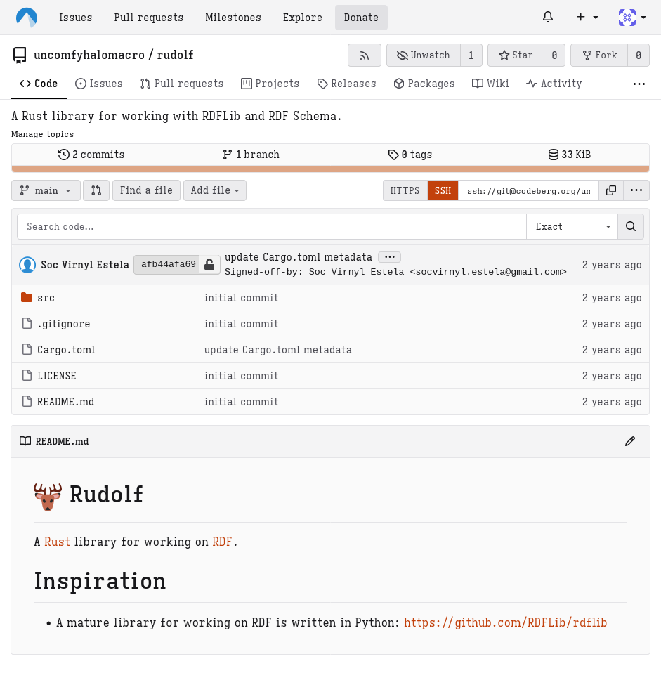

+++
title = "Getting sentimental on my personal projects"
date = 2025-05-25
authors = ["Soc Virnyl Estela"]
+++

I don't know where to start. So I am just writing this out of my head. This thought
started after I looked at my projects, including dead ideas and I saw the
number of years that passed and for me, it felt sentimental. Yes, it felt
nostalgic.

Take for example, the [rudolf](https://codeberg.org/uncomfyhalomacro/rudolf)
crate.  It started as an idea, though by now after 2 years, it's probably
dead but it was still something I tried to work on. I have many project
ideas and they were either just sitting there collecting digital dust.

But honestly, writing software projects for me is a fun escape from the
mundane things in life. I do read comics a lot, go out with some friends,
chat online, play a bit of games—but writing software became something
that I always look forward to, as long as I am not burnt out, of course.

I think the most probable reason for why I decided to write this is to remind
myself that these projects, dead or not, are proof that I tried to make a
difference for myself and validate my existence on this planet?

As I grow older, it's one responsibility after another and it sometimes
overwhelm me to the point that I get so tired, I don't want to do anything at
all but focus on finding some form of escape—I mean aren't we all finding
a way to make life seem a bit _bearable_?

And for me, writing software and getting involved in open source was my way
of proving myself that I at least have some purpose. Each commit message,
each commit date, and each refactor—they're proof that I tried to work
hard, that I have a talent to learn and keep on learning despite the living
conditions, and the harshness of life while earning through honest work.

I might have made some mistakes here and there, any kind of mistake, not
just software, but writing software and journaling also became my way of
clearing out my thoughts. It's kind therapeutic.

I find myself laughing writing this, telling myself I am older when I am
at the age of 25 or 26 (since I will turn 26 this year), and most people
consider it "young".

But it does not change what I have felt that time really flies so fast...

and the only way to prove that I exist is to put my name into those commit messages.

Anyway, I am just sharing my thoughts. And I hope this post does help you a
bit validate that you're not the only one thinking like this.
