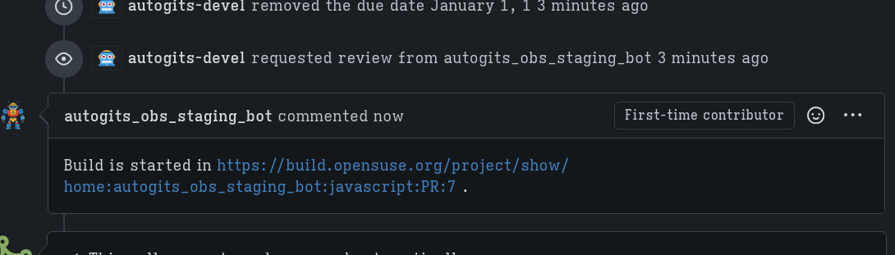

+++
title = "Let's revisit packaging with SCMSync workflow"
date = 2025-07-20
updated = 2025-07-21
authors = ["Soc Virnyl Estela"]
[taxonomies]
tags = [
"packaging",
"openbuildservice",
"opensuse"
]
+++

So here I am doing another attempt at updating a package in openSUSE. This package is [biome](https://biomejs.dev). As of writing,
it's way behind 1 minor version, and still at version 2.0.5.

# Preparing to fork and clone

The first thing I did was login to <https://src.opensuse.org> with my openSUSE account.


Once logged in, I headed to <https://src.opensuse.org/javascript/biome>.


I clicked the fork button on the upper-right and cloned the repository to inside a local directory, in this case,
mine is located at `~/development/git-obs/` since this kind of workflow does not really require a "root"
OBS directory e.g. `~/development/obs` where it contains directories to projects such as my home project
`home:uncomfyhalomacro` that contains packages or subprojects.


# Updating the sources

I deleted the sources first with the following commands:

```bash
cd biome  # heading into the git repository
git rm *.tar*  # deleting the sources
```

FYI, I accidentally ran `osc rm *.tar*` at first because I was still stuck with the mindset using the old workflow.


The latest version as of writing is now at 2.1.2 or specifically, at the git tag `@biomejs/biome@2.1.2`. Seems they use a
different naming scheme for tagging versions but it's still 2.1.2. No worries because the `Source0` points to
the archive of the same naming scheme.


Then I ran the following command.

```bash
osc service -vvv mr
```


As you can see from the image above, biome has a lot of crate dependencies.

This command produced two new tarballs, `biome-2.1.2.tar.gz` and a refreshed `vendor.tar.zst`.

# Updating the changes file

I ran the following command to update the `biome.changes` file.

```bash
osc vc
```

However, this makes this a manual process because there is no perfect way to get all changelogs. Hence,
I have to clone the upstream biome repository on GitHub.


Then ran the following commands to get each commit summary between 2.0.5 and 2.1.2.

```bash
git log @biomejs/biome@2.0.5..@biomejs/biome@2.1.2 --oneline | cut -d' ' -f2- | wl-copy
```


# Commiting and pushing the changes

Then I committed those changes after adding the updated files and removing the old sources.


I ran `git push`. Remember that this operation should have Git LFS enabled.

# Setting the meta project and meta package

At this point, if I was sure that this will build correctly, I can just open a PR to <https://src.opensuse.org/javascript/biome>.

However, just for showing how I set a meta project and a meta package, I ran the following commands.

```bash
osc meta prj -e home:uncomfyhalomacro:biomejs
```

The XML file configuration for this meta project is this.

```xml
<project name="home:uncomfyhalomacro:biomejs">

  <title></title> <!-- Short title of NewProject -->
  <description></description>
    <!-- This is for a longer description of the purpose of the project -->

  <!-- Uncomment and specify an URL and branch if your project is managed in git.
  <scmsync>url#branch</scmsync>
  -->

  <person role="maintainer" userid="uncomfyhalomacro" />
  <person role="bugowner" userid="uncomfyhalomacro" />
<!-- remove this block to publish your packages on the mirrors -->
  <publish>
    <disable />
  </publish>
  <build>
    <enable />
  </build>
  <debuginfo>
    <enable />
  </debuginfo>


  <repository name="openSUSE_Factory">
    <path project="openSUSE:Factory" repository="snapshot" />
    <arch>x86_64</arch>
    <arch>i586</arch>
  </repository>

</project>
```

Take **note** that I did not set scmsync option for this because I don't need to or I have not learned to set a git project as a meta project's scmsync option yet.

For package setup, I pointed it to the new meta project and then added a suffix `/biome` to create a package biome.

```bash
osc meta pkg -e home:uncomfyhalomacro:biomejs/biome
```

Sadly, I am not too fluent with how the XML configuration works. So I just passed this one instead

```xml
<package name="biome">

  <title></title> <!-- Title of package -->

  <description></description> <!-- for long description -->

  <scmsync>https://src.opensuse.org/uncomfyhalomacro/biome#main</scmsync>

<!-- following roles are inherited from the parent project
  <person role="maintainer" userid="uncomfyhalomacro"/>
  <person role="bugowner" userid="uncomfyhalomacro"/>
-->
<!--
  <url>PUT_UPSTREAM_URL_HERE</url>
-->

<!--
  use one of the examples below to disable building of this package
  on a certain architecture, in a certain repository,
  or a combination thereof:

  <disable repository="SUSE_SLE-10"/>
  <disable repository="SUSE_SLE-10" arch="x86_64"/>

  Possible sections where you can use the tags above:
  <build>
  </build>
  <debuginfo>
  </debuginfo>
  <publish>
  </publish>
  <useforbuild>
  </useforbuild>

  Please have a look at:
  http://en.opensuse.org/Restricted_formats
  Packages containing formats listed there are NOT allowed to
  be packaged in the openSUSE Buildservice and will be deleted!

-->

</package>
```

Notice the scmsync option. I pointed it to my fork and with the branch "main".

Fortunately, the meta project has the correct config for setting which images to use for the build workers.


For clarity, the full link to the build after setting the meta project and meta package is <https://build.opensuse.org/package/show/home:uncomfyhalomacro:biomejs/biome>. You may not be able to access this in the future because
I probably deleted the meta project.

I waited for the builds to succeed.


One of the builds succeeded after a while.


# Making a PR

Lastly, I created a PR from my fork to the javascript project


The **autogits-devel** bot will stage my changes (with the **autogits_obs_staging_bot**) and creates a new meta project for testing my PR.

It basically just did what I did in the last steps where I created a meta project and meta package and check if the builds succeed.





Once the builds succeed, my changes are then merged.

The merge message should look similar to the one I had for **rusty_v8** (see image below).


# Conclusion

~~At this point, I am not familiar how those changes are pushed into Factory~~. I believe there will be an automation as well
for pushing devel packages from devel projects to Factory. I also believe that the <https://opensuse.github.io/scm-staging/user_guide.html> is
deprecated or inaccurate because of this experience.

In conclusion, I guess this is how far I can understand how the SCMSync workflow works. If you have any questions, just
[email me](mailto:uncomfyhalomacro@opensuse.org) or message me in [openSUSE Discord](https://discord.gg/opensuse).

# Updated Last Step–SR a devel project to Factory

Avindra, one of the packagers, messaged me on Discord and that there is a part I missed. To submit a devel project
to Factory, one can just do the same thing as mentioned in <https://en.opensuse.org/openSUSE:OBS_to_Git#How_to_submit_from_devel_project_to_Factory?>.

Hence, for biome, it would be just

```bash
osc sr devel:languages:javascript/biome openSUSE:Factory
```

But when I did this, the rev is suspicious and also there was no changelog. I aborted because I then discovered that
the meta package is still building for RISCv64. It's still building after I slept for 8 hours... 🤣

Thus, I SR-ed for rusty_v8. I will SR for deno too after a few days to let the snapshot have rusty_v8. 🙂


