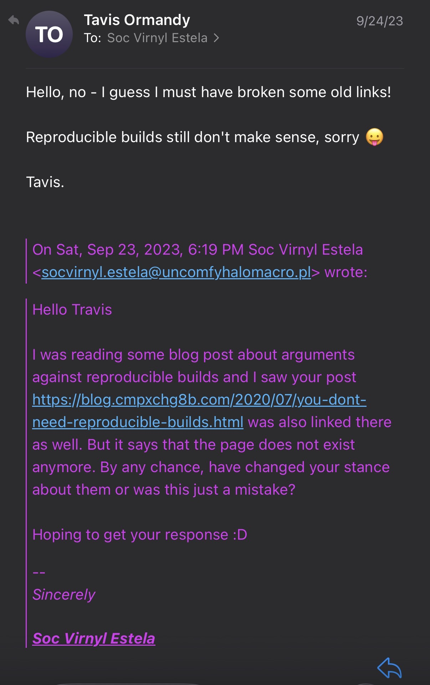

+++
title = "Reproducible Builds Does Not Prevent Threats"
authors = ["Soc Virnyl Estela"]
date = 2026-02-06
[taxonomies]
tags = [
  "security"
]
+++

> **Disclaimer**: I am not a security researcher or a cybersecurity expert.
> I am sharing my stance based on my understanding and limited research on the topic.

I remembered in my project [obs-service-cargo][obs-service-cargo] that there
were some opened issues [#64][64] and [#72][73]. These two issues told that the
project does not produce **idempotent** or **deterministic** build outputs yet
it _passed **audits**_.

Honestly, at that time, I don't know much about reproducible builds but I do know that
it is an attempt to build a project from different builder sources and **hopefully**,
it matches the checksum of their build outputs.

PR [#78][78] actually "fixed" the bug. But I still have doubts. And after
learning it from William Brown, aka, _firstyear_, from his [blog][fy-blog] and
from [Taviso's blog][tavis-blog], I realised that reproducible builds does not
take account the social engineering in risk modelling when it comes to human behaviour.

> You might wonder if Taviso has changed his stance since it is on web archive (or wayback machine) now but I did
> email him and he replied that he didn't change his stance on the matter.
> 

Yes, this post was overdue and was supposed to be written 3 years ago but I can't sleep and
I am bored so while I still have this in mind, why not write a new post?

# An example of an upstream and downstream build

This might not be the best excalidraw + mermaid diagram but I hope it shows an overview of
how a downstream and upstream builds their own sources. Let's call this project, Project UWU.


As you can see here, if we take this literally like how the flowchart looks like, under
no circumstances that sources and built sources from both upstream and downstream contains
any malicious intent (well... there is no mention of it yet). But that's from an ideal world,
and we are living in one where there are also evil people (_I am one of them_ 😈).

Joking aside, let's assume that the sources from upstream built the same
checksum following reproducible build principles.

```
source has checksum 'abcd'
built source has checksum 'uwuwu'
```

Of course, the downstream one
has a different checksum for its built sources than the upstream one. But both will
have the checksum for the _unbuilt sources_ themselves, usually a tarball or zip archive.

```
source has checksum 'abcd'
built source after patches has checksum 'notuwuenough'
```

The benefit of this is that if let's say a distribution have to rebuilt its sources since other packages
have updated but the underlying compiler tool necessary to build Project UWU still has unchanged version
and is the same across all updated machines. Therefore, we can skip building the downstream variant of
Project UWU.

# Do not ever forget the evil people

Remember what I said about social engineering and evil people? Yes, they exist.
What can you even do about them? Nothing. They can do whatever the hell they
want.

The keyword we should talk about here is ***Trust***, (_[not the Filipino brand](https://trust.ph/methods/condoms/)_).

Let's update our flowchart again so you can see what I mean.


As you can see from the flowchart above (_please zoom or open it in a new tab huhu_), **IT ONLY TAKES 1 CHANGE OF MAINTAINER
FOR UPSTREAM TO ACTUALLY BECOME A THREAT**. _The same thing could be said to the downstream maintainer_.

In the case of the upstream, this would affect the whole supply chain since

1. Downstream relies on it
2. It's the only thing that exists
3. Because there is no other person or persons to maintain this so YOLO?

In the case of the downstream, this would affect the partial (and sometimes whole) supply chain since

1. They can provide "innocent" patches to both downstream and upstream
2. Consumers are using it on the downstream distribution because they trust the downstream maintainer

> Yeah, Project UWU can un-cute itself because of evil people 😝

# So how can reproducible builds not protect us

What I can see from here is that reproducible builds cannot protect us from these kinds of threats because

1. It only takes 1 evil person to fuck up the supply chain
2. Trusting is hard and in this kind of scenario, your only option is to trust that the
maintainer/contributor is not a psychopath.
3. The checksums do not matter when you are already compromised. However, _you can keep a record of the
checksum of a malicious source_.

The only way reproducible builds can mitigate threats, from what I can
understand, is ***after the threats has happened***. ***But it does not protect
us from any present event a compromised source/build has happened until it is noticed***.

# But what about being reproducible?

Well, it does help with build times, but eh... that's the only benefit it can give—to save energy and compute.

# Conclusion

I know I know I am repeating words, I haven't even looked at the blog posts just
to see if I can remember what I understand about why reproducible builds cannot
protect us from present threats. I am not a cybersecurity expert either. But I
have a big imagination.

The only benefit I can imagine from reproducible builds is a record of checksums of
malicious sources as well as the record of checksums of malicious built sources.

But it is a fact that many are passionate in building infrastructure around it
just to prove that it works. However, it still fails to address the social
engineering which is a big factor in security.

Anyway, goodnight. I think it's 2AM now around my timezone. I need to fix my sleep schedule.

[obs-service-cargo]: https://github.com/openSUSE-Rust/obs-service-cargo
[73]: https://github.com/openSUSE-Rust/obs-service-cargo/issues/73
[64]: https://github.com/openSUSE-Rust/obs-service-cargo/issues/64
[78]: https://github.com/openSUSE-Rust/obs-service-cargo/pull/78
[tavis-blog]: https://web.archive.org/web/20200805120504/https://blog.cmpxchg8b.com/2020/07/you-dont-need-reproducible-builds.html
[fy-blog]: https://fy.blackhats.net.au/blog/2021-05-12-compiler-bootstrapping-can-we-trust-rust/
