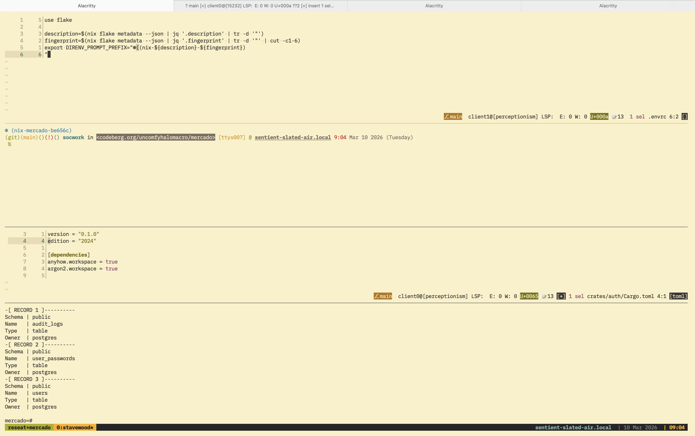

+++
title = "Part 3: So I am building a fullstack project"
date = 2026-03-10T00:51:55Z
[taxonomies]
tags = [
"mercado-series",
"rust", "typescript", "fresh", "deno", "fullstack"
]
+++

Now back to the progress. I was busy with other personal stuff lately.

I've decided to rework some of the SQL schemas of the tables.

```sql
CREATE TABLE users (
    id uuid PRIMARY KEY,
    roles INTEGER[] NOT NULL,
    first_name TEXT DEFAULT NULL,
    last_name TEXT DEFAULT NULL,
    email TEXT NOT NULL,
    created_at TIMESTAMPTZ DEFAULT NOW(),
    updated_at TIMESTAMPTZ DEFAULT NOW(),
    CONSTRAINT unique_email UNIQUE (email)
);

CREATE TABLE user_passwords (
    id uuid PRIMARY KEY,
    user_id uuid NOT NULL REFERENCES users(id) ON DELETE CASCADE,
    password_hash TEXT NOT NULL,
    created_at TIMESTAMPTZ DEFAULT NOW(),
    updated_at TIMESTAMPTZ DEFAULT NOW(),
    CONSTRAINT FK_userId FOREIGN KEY (user_id) REFERENCES users(id),
    CONSTRAINT unique_user_id UNIQUE (user_id)
);

CREATE TABLE audit_logs (
    id UUID NOT NULL,
    table_oid OID, -- pertains to the oid of the table in the information schema. aliased to a u32 integer
    entity_id UUID NOT NULL, -- this pertains to the table row's id
    event_type TEXT NOT NULL, -- actions that happened such as adding products in stock. Removing them will remove this row as well
    data JSONB,
    created_at TIMESTAMPTZ DEFAULT now()
);

CREATE TABLE products (
    id UUID PRIMARY KEY,
    seller_id UUID NOT NULL,
    name TEXT NOT NULL,
    description TEXT,
    item_type TEXT NOT NULL, -- product, service
    unit_price NUMERIC(12,2),
    currency CHAR(3),
    metadata JSONB, -- extra metadata the seller or us wants to include without changing the table
    is_active BOOLEAN DEFAULT TRUE,
    created_at TIMESTAMPTZ DEFAULT now(),
    updated_at TIMESTAMPTZ DEFAULT now()
);
```

I already made some migration scripts as well, except for products (I actually
have forgotten I didn't implement a migration for products).

# Switching over to Nix for Development Environment Management

I made some changes as well on how I manage my development environment. I am
using `nix`, specifically the one made by <https://determinate.systems> since
they have the best configuration on a macOS environment as far as I know. Since
I don't have time to relearn the Nix language, I decided to use what I can
remember plus with the help of LLMs like ChatGPT and Gemini.

I also adjusted my shell environment with the help of `direnv`. [Mmfallacy](https://github.com/mmfallacy) suggested
to add some sort of indicator to my shell prompt that I am inside a Nix environment, so I came up with
modifying the following lines to my `~/.zshrc`.

```zsh
export PROMPT=$'\$vcs_info_msg_0_%F{010} %B%F{blue}%n%b%f in %F{black}%K{7}<%3~>%k%f %F{yellow}[%y] %F{green}@ %B%U%F{white}%M%u%b %F{red}%T %F{white}%D{%b %d %Y (%A)}
%{\x1b[0m%}%(?.%F{green} .%F{red}%? )%%%F{none} '
export PROMPT='%F{#2685bd}${DIRENV_PROMPT_PREFIX:+$DIRENV_PROMPT_PREFIX}%f'$PROMPT
```

To get the `DIRENV_PROMPT_PREFIX` environment variable, I adjusted the project's `.envrc` that `direnv` uses

```
use flake

description=$(nix flake metadata --json | jq '.description' | tr -d '"')
fingerprint=$(nix flake metadata --json | jq '.fingerprint' | tr -d '"' | cut -c1-6)
export DIRENV_PROMPT_PREFIX="❄️(nix-${description}-${fingerprint})
"
```

This way, `direnv` will inject new environmental variables to my shell's RC. Now, my prompt looks like
the screenshot below.



I am not sure how useful `description` and `fingerprint` fields are but I guess
that's fine because I can determine which environment using their uniqueness whenever if I have multiple
projects managed by flakes in the future.

Because of this, even I tested that it's possible to use PostgreSQL outside homebrew so I uninstalled it and
adjusted my `justfile` now to look like this

```just
set shell := ["bash", "-cu"]
set dotenv-load

serve: serve
test-user-models:
	just migrate-down || true
	just migrate-up || true
	cargo test

migrate-up:
	cargo run --bin up_0001_users || true
	cargo run --bin up_0002_audit_logs

migrate-down:
	cargo run --bin down_0001_users || true
	cargo run --bin down_0002_audit_logs


build-backend:
	cargo build

serve-backend: build-backend
	cargo run

build-frontend:
	cd frontend && deno task build

serve-frontend:
	cd frontend && deno task dev

start-db:
	if [ ! -d "${PGDATA}" ]; then initdb -D ${PGDATA}; fi
	pg_ctl -o "${INIT_DB_OPTIONS}" -D ${PGDATA} start

stop-db:
	pg_ctl -D ${PGDATA} stop

```

# Using Something Similar to Builder Pattern

I am also using the builder pattern when I am creating new methods for each of my model structs.

For example, I made a separate method for `save_to_db` because I believe that it should be a separate concern.

As demonstration, here is the `Users` model

```rust
impl Users {
    pub fn new(first_name: Option<String>, last_name: Option<String>, email: String) -> Self {
        Self {
            id: Uuid::new_v4(),
            roles: Vec::new(),
            first_name,
            last_name,
            email,
            created_at: Utc::now(),
            updated_at: Utc::now(),
        }
    }

    pub async fn save_to_db(&self, pool: &Pool) -> Result<Row, PoolError> {
        let client = pool.get().await?;
        let stmt = client.prepare_cached("INSERT INTO users (id, roles, first_name, last_name, email, created_at, updated_at) VALUES ($1, $2, $3, $4, $5, $6, $7) RETURNING *").await?;
        let roles: Vec<i32> = self.roles.iter().map(|&x| x as i32).collect();
        let row = client
            .query_one(
                &stmt,
                &[
                    &self.id,
                    &roles,
                    &self.first_name,
                    &self.last_name,
                    &self.email,
                    &self.created_at,
                    &self.updated_at,
                ],
            )
            .await?;
        Ok(row)
    }

    pub fn hash_password(
        &self,
        plain_text_password: &str,
    ) -> Result<UserPasswords, password_hash::Error> {
        let salt = SaltString::generate(&mut OsRng);
        let password = plain_text_password.as_bytes();
        let argon2 = Argon2::default();
        let password_hash = argon2.hash_password(password, &salt)?.to_string();
        let id = Uuid::new_v4();
        Ok(UserPasswords {
            id,
            user_id: self.id,
            password_hash,
            created_at: Utc::now(),
            updated_at: Utc::now(),
        })
    }

    pub async fn get_user_password_hash(&self, pool: &Pool) -> Result<UserPasswords, PoolError> {
        UserPasswords::from_user_id(pool, &self.id).await
    }
}
```

And the tests that go alongside it.

```rust
// snipped...
    #[tokio::test]
    async fn add_user() {
        dotenv().ok();
        let cfg = Config::from_env().unwrap();
        let pool = cfg.pg.create_pool(Some(Runtime::Tokio1), NoTls).unwrap();
        assert!(table_exists(&pool, "users").await.unwrap());
        let new_user = Users::new(
            Some("David".to_string()),
            Some("Attenborough".to_string()),
            "contact@david_attenborough.com".to_string(),
        );
        let secure_password = "very_secure";

        new_user.save_to_db(&pool).await.unwrap();
        let password = new_user.hash_password(secure_password).unwrap();
        assert!(password.save_to_db(&pool).await.is_ok());
    }

    #[tokio::test]
    async fn verify_password() {
        dotenv().ok();
        let cfg = Config::from_env().unwrap();
        let pool = cfg.pg.create_pool(Some(Runtime::Tokio1), NoTls).unwrap();
        assert!(table_exists(&pool, "users").await.unwrap());
        let new_user = Users::new(
            Some("Fred".to_string()),
            Some("Adila".to_string()),
            "contact@fredadila.com".to_string(),
        );
        let secure_password = "very_secure";

        new_user.save_to_db(&pool).await.unwrap();
        let password = new_user.hash_password(secure_password).unwrap();
        assert!(password.save_to_db(&pool).await.is_ok());
        assert!(password.verify_password("incorrect").is_err());
        assert!(password.verify_password("very_secure").is_ok());
    }
// snipped...
```

That means if we ever write something from initializing new data to saving it to a database, it would look like

```rust
let password_plain = "verysecure_password";
let user = Users::new(somedata);  // somedata is just placeholder
let user_password = user.hash_password(password_plain);
user.save_to_db(&pool).await.unwrap();
user_password.save_to_db(&pool).await.unwrap();
```

I believe I can wrap `deadpool_postgres::Pool` with a `Mutex` or `Arc` because I
feel like I am repeating myself whenever I am passing a `Pool` to the method.

The reason that I am against it is because of the nature of the struct fields
themselves.

They are clearly mirrored to the SQL schema that I made so if I
will add a `pool` field, it would lose its representation and that will likely
not communicate well with the model I made.

Hence, I am leaving it at that, to ensure they don't lose what they represent. _But I think I can wrap the `pool` outside the structs themselves_.

# What's next

I will continue adding the migration logic for products and proceed building the `auth` crate. The `auth` crate should have the following

- JWT attestation logic
- Basic Auth logic
- OAuth2.0 logic

That's all for now. I'll go continue reading a new manhwa again. Binging never ends.
